## what PSYTEACHR did

:::: {.columns}

::: {.column width="40%"}
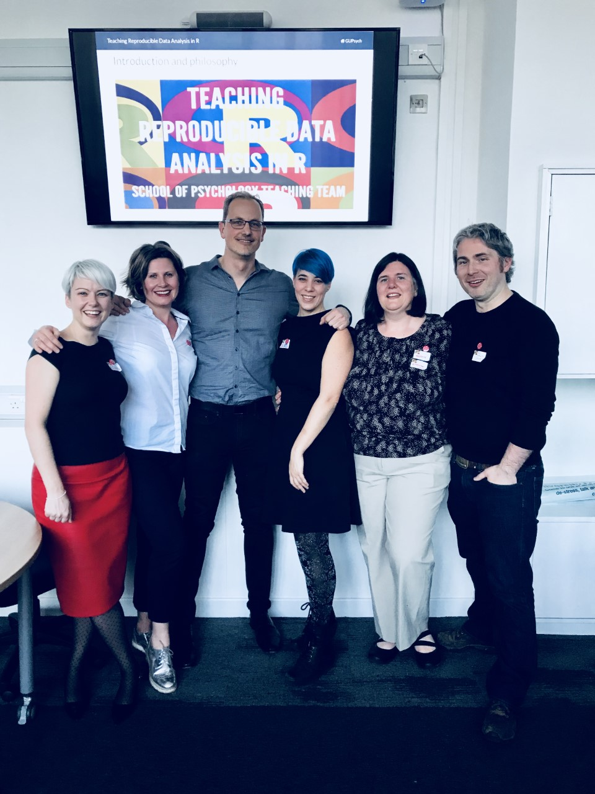
:::

::: {.column width="60%"}
- critical mass of research & teaching staff and students following open research practices
- established an award-winning curriculum emphasizing open research for undergraduates and postgraduates
- released our curriculum as freely-available open educational materials (textbooks)
  <https://psyteachr.github.io>
- got 'data skills' on the agenda for British Psychological Society accreditation

:::

::::

{.absolute bottom=20 left=20}

## on taking advice from your elders

::: {.notes}

- a **personal history** of how we developed a culture of open research at the University of Glasgow
  - **why** we did what we did, and **how** we did it
  - why (I think) **it worked and is still working**
  - **tips** for making changes at your own institution

- a little lesson about taking advice from your elders

:::

:::: {.columns}

::: {.column width="50%"}

::: {.fragment}

### career advice (~2002)

> "Teach statistics. Course prep is one and done. It's not like someone will come up with a better way of doing regression anytime soon."

:::

:::

::: {.column width="50%"}

::: {.fragment}
### life advice (~2005)

> "Buy a house, don't throw your money away on rent. Real estate always goes up in California. You can't lose."
:::

:::

::::

:::: {.columns}

::: {.column width="50%"}

::: {.fragment}

:::

:::

::: {.column width="50%"}

::: {.fragment}
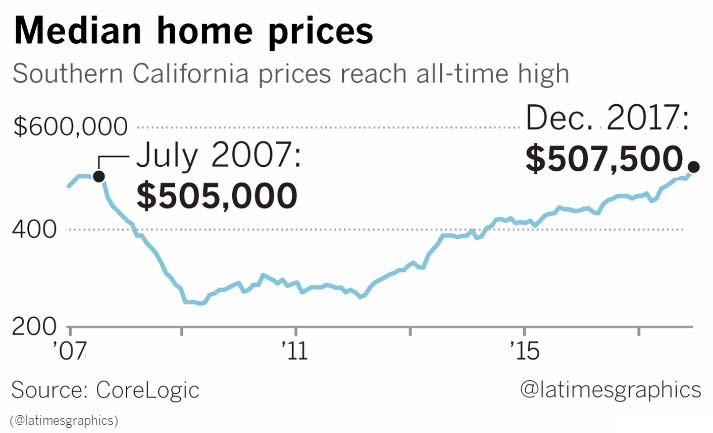
:::

:::

::::

## University of California, Riverside (2002-2010)

{fig-align="center"}

- MAMA journal club run by Dan Ozer, David Funder, and Bob Rosenthal
- 2003: Chandra Reynolds introduced me to "Hierarchical Linear Modeling"
- 2006: Doug Davidson (MPI-NL) introduced me to `lme4`


## glasgow (2010)

teaching 3rd year statistics; Methods & Metascience (Nov 11)

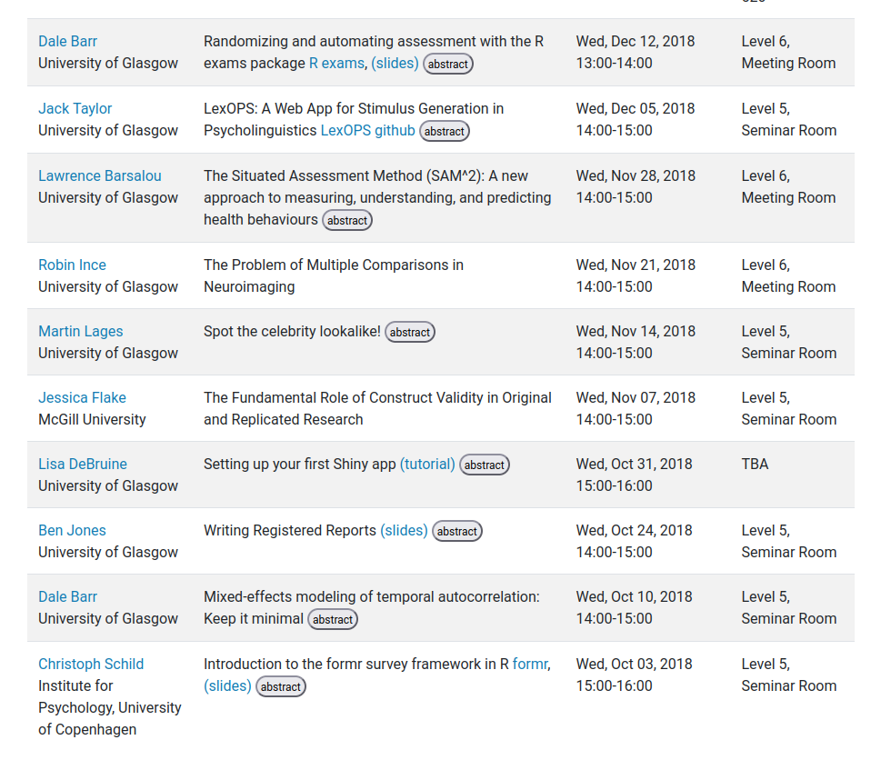{fig-align="center"}

## new responsibilities

statistics drop-in hours for UG students completing their theses

::: {.fragment}

{fig-align="center"}

:::

::: {.notes}

- we are not the first to convert our programme to totally R
- my goal was empowerment not reproducibility

:::

# curriculum review

**"What is something observable that you think students in your field ought to be able to do when they graduate, and are you adequately preparing them to do this?"** [@Nolan_Temple_lang_2010]

::: {.fragment}

> all final year students must be able to "carry out an extensive piece of empirical research that requires them **individually** [*my emphasis*] to demonstrate a range of research skills, including planning, considering and resolving ethical issues, analysis and dissemination of findings" (**QAA HE Benchmark statement 2019**) 

:::

## the fiction we pretend exists... {.smaller}

```{r}
#| label: read-stroop-demo
#| message: false
#| warning: false
library("tidyverse")

.fi <- read_csv("fake-data/subject-means.csv", col_types = "ccc")
knitr::kable(.fi |> group_by(eng_lang) |> slice(1:3) |> ungroup())
```

 > "Here is a table of (artificial) response times from `{r} nrow(.fi)` participants who performed a Stroop interference task (`stroop.xlsx`). Response times are measured in milliseconds. Calculate descriptive statistics and test the hypothesis that the *interference effect* differs across language groups. Write up your results in APA format."

:::: {.columns}

::: {.column width="50%"}


"green" (incongruent)
:::


::: {.column width="50%"}


"blue" (congruent)
:::

::::

## ...and the messy reality we keep hidden

```{r}
dir("fake-data") |> setdiff("subject-means.csv")
```

You ran a Stroop experiment using a computer program that spits out a separate CSV file (`SXX.csv`) for each participant. Participants made *vocal* responses into a microphone, and each response was recorded into a separate soundfile. The program used a "voice key" algorithm to detect the onset of speech, but it was not 100% reliable. It also stored the response in a soundfile, and you later went in and transcribed all the files into a single spreadsheet by hand (`transcript.csv`). You also kept track of participant demographics (`demographics.csv`) later realized that you forgot to record 'first language' values for some of the participants so you ran a few more.

## `demographics.csv`

:::: {.columns}

::: {.column width="50%"}

```{r}
d_demo <- read_csv("fake-data/demographics.csv", col_types = "iic")
knitr::kable(d_demo |> slice(1:10))
```

::: 

::: {.column width="50%"}

::: {.fragment}

- data provenance = human, therefore need to check for typos/inconsistencies

```{r}
#| echo: true
d_demo |>
  count(eng_lang)
```

:::

:::

::::

## `transcript.csv`

:::: {.columns}

::: {.column width="50%"}

```{r}
d_trc <- read_csv("fake-data/transcript.csv", col_types = "iic")
knitr::kable(d_trc |> slice(1:10))
```

:::

::: {.column width="50%"}

::: {.fragment}

- data provenance = human, therefore need to check for typos

```{r}
#| echo: true
d_trc |>
  count(response)
```

:::

:::

::::

## `S02.csv` {.smaller}

:::: {.columns}

::: {.column width="60%"}

```{r}
set.seed(1451)
d_s02 <- read_csv("fake-data/S02.csv", col_types = "iicc")
knitr::kable(d_s02 |> slice(1:10))
```

:::

::: {.column width="40%"}

::: {.fragment}

- participant ID is in the filename
- each participant's data is in separate files; need to combine them
- trial condition (congruent/incongruent) is in the stimulus filename
  - `BLUE-purple.png` = incongruent
  - `RED-red.png` = congruent
- response time must be computed by comparing adjacent `DISPLAY_ON` and `VOICE_KEY` timestamps
- we need to get rid trials with (1) voice key failure; and (2) inaccurate responses
  - but to calculate accuracy we have to extract word identity and font color and combine with `transcript.csv` data

:::

:::

::::

## the 'data skills' gap [@McAleer_2022_embedding]

- importing data
  - checking for typos/inconsistencies
- transforming data
  - getting data into the 'right place (e.g., participant ID in a filename)
  - joining together data in separate tables
  - computing new values from existing values (e.g., accuracy)
  - pivoting from long to wide or (vice versa)
- reporting results
  - copy/pasting into word vs dynamic reports

::: {.aside}

:::

# when does the bill come due? (and who pays?)

- **invisible labor** for supervisors / ECRs / local gurus
- hours of wasted effort doing things the most inefficient and error prone way
- insecurity and negative self-image for students
  - perception that untaught parts must be 'easy' or self-evident and possibly... that "science is not for me"

# convergence with the Zeitgest 

- systematization of data wrangling (Hadley Wickham)
  - simplification and development of the language
- appearance of exciting new software tools
- psychology entered a new phase of radical self-reflection and self-doubt

# @Wickham_2014 on tidy data

1. Each variable forms a column.
2. Each observation forms a row.
3. Each type of observational unit forms a table.

# and tidy tools to work with (2014-2016)

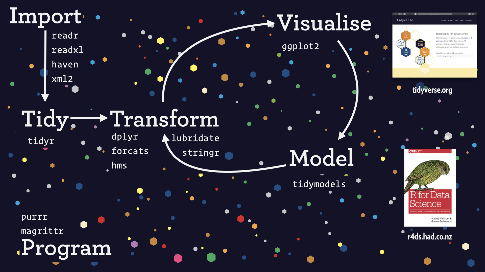{fig-align="center"}

::: {.notes}

- first iteration of dplyr: 2014
- most packages existed: 2015
- first release of tidyverse: 2016

:::

# The "Wickham Six" 

- one-table verbs

| verb          | what it does                               |
|---------------|--------------------------------------------|
| `select()`    | include/exclude/rename variables (columns) |
| `filter()`    | include/exclude cases (rows)               |
| `arrange()`   | sort the cases (rows)                      |
| `mutate()`    | compute new variables (column)             |
| `group_by()`  | change the unit of analysis                |
| `summarize()` | calculate aggregate values                 |

Claim: these six operations cover about 90% of data wrangling tasks

with these and the two-table verbs `inner_join()` and `pivot_longer()` / `pivot_wider()`, we cover almost everything

# pipes made code readable

The `{magrittr}` pipe `%>%` (Stefan Milton Bache), later incorporated into `{dplyr}` and which inspired the later base R pipe `|>` made reading code like reading English text.

Compare:

:::: {.columns}

::: {.column width="50%"}
```{r}
#| eval: false
#| echo: true
## find outliers
filter(select(data, ID, RT), RT > 3000)
```

:::

::: {.column width="50%"}
```{r}
#| eval: false
#| echo: true
## find outliers
data |>
  select(ID, RT) |>
  filter(RT > 3000)
```
:::

::::

# RStudio IDE made code development very nice

(and very free)


# dynamic reports were always exciting

...and offered a new way of teaching

- literate programming [@knuth_1984] via Emacs org-mode ([Carsten Dominik, 2003](https://orgmode.org))
  - org markdown → (html | LaTeX → PDF)
- Sweave (Friedrich Leisch, 2002)
- knitr (Yihui Xie, 2012)
- RMarkdown (Xie, Allaire, Grolemund, 2013-4)
- bookdown (Xie, 2016)
- quarto (2022-present)

## ...and of course... 

reproducibility crisis (2012-?)

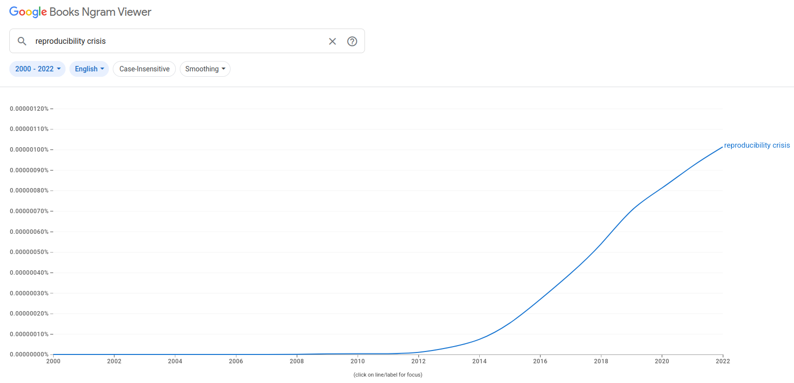

## computational reproducibility 

[@Hardwicke_et_al_2018]

:::: {.columns}

::: {.column width="70%"}

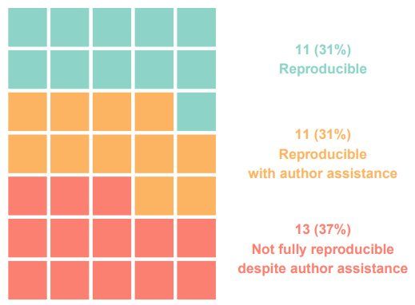{fig-align="center"}

:::

::: {.column width="30%"}

- study of papers published in *Cognition* (2014-17) as a result of new open data policy
- open data is not enough

:::

::::

## {background-image="img/iceberg.png" background-size="contain"}

# how we did (and are still doing) it

- assemble a team (2011-4)
- train staff and provide support (2014-5)
  - **separately** for staff and students
- adapt curriculum incrementally
  - 2014: Level 3
  - 2015: +Level 2
  - 2016: +Level 1
  - ...and re-calibrate each year
- released our online course materials (2019)
  - updated almost every cycle

## Current undergraduate programme

| Year | Topics                                                                                       |
|------|----------------------------------------------------------------------------------------------|
| 1    | RStudio IDE, R, data import, dynamic reports, data wrangling, summaries, probability [(book)](https://psyteachr.github.io/data-skills-v3/) |
| 2    | data wrangling, data visualization, data distributions, t-test, correlation, regression, ANOVA [(book)](https://psyteachr.github.io/analysis-v4/)      |
| 3    | General Linear Model (multiple regression), model comparison, mixed-effects regression, structural equation modeling [(book)](https://psyteachr.github.io/stat-models-v2/)        |
| 4    | advanded topics (e.g., cluster analysis, bootstrapping)                                      |

- highly recommended for postgrads or staff wanting to upskill ["Data Skills for Reproducible Research"](https://psyteachr.github.io/reprores-v5/) 1-semester MSc course
- we also have a compact 1 year ["zero to hero" course for our online Master's programme (QuantFun)](https://psyteachr.github.io/quant-fun-v3/)

# an accelerating learning trajectory

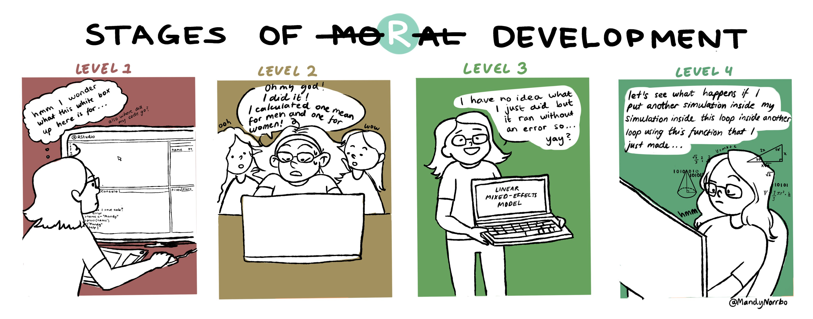

# when our UGs become postgrads...

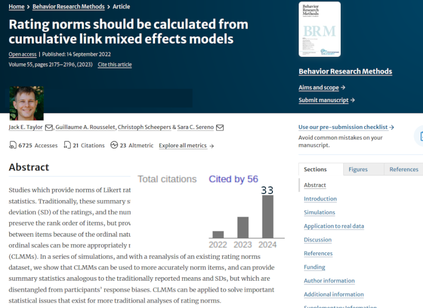{fig-align="center"}

# 

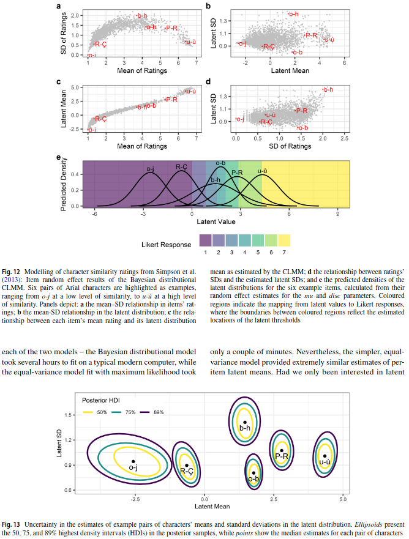{fig-align="center"}


# case study: how to sneak data wrangling and dynamic reports into an assignment on multiple regression

# assignment workflow

- students receive an [RMarkdown 'stub' file](multiple-regression-stub.html){target="_blank"} via content management system (CMS)
- the problem is broken down into stages, each of which has a code chunk with variables set to `NULL`
- student fills code into the chunks, checks that it knits (*if the Rmd doesn't knit, you must not submit*) and submits it
- we run our own assessment package on a folder containing the stub files and then manually review and adjust [`{assessr}`](https://github.com/dalejbarr/assessr.git)
- generate feedback files that are re-uploaded to the CMS where code is shown against the [solution](multiple-regression-solution.html){target="_blank"} and instructor feedback

# want big changes? you need a team {.smaller}

Engaging in open practices is a risky behavior, and risky behaviors don't spread like viruses do. They require a network based on strong, trusted, local connections [@Centola_Macy_2007].

:::: {.columns}

::: {.column width="50%"}
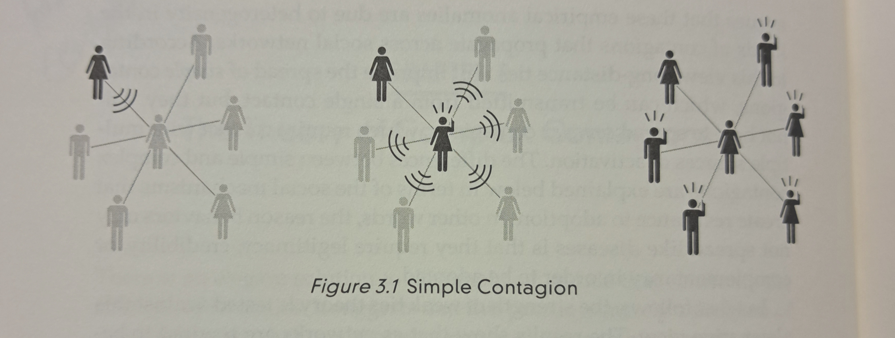
:::

::: {.column width="50%"}
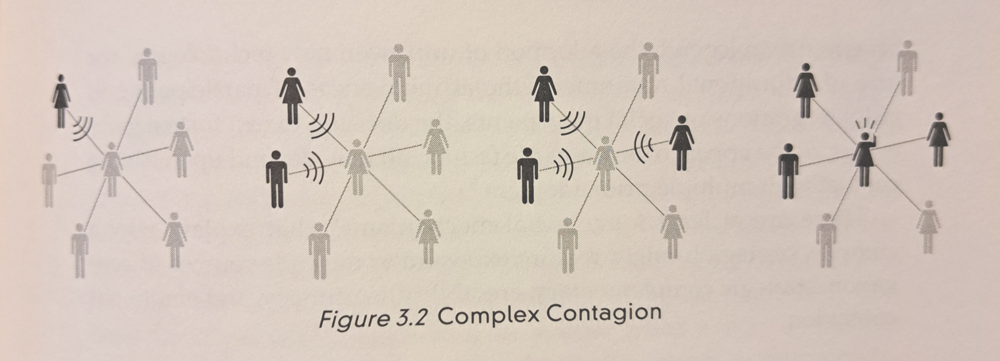
:::

::::

Any changes you make won't stick unless you have a team to form a united front against the inevitable pushback!

:::: {.aside}

::::

## but I don't have a team!

:::: {.columns}

::: {.column width="50%"}

Are you invested long-term in your institution? You can build it!

- Start with an inwardly-focused methods / stats journal club, offer training events, build from there (see [ReproducibiliTea.org](https://reproducibilitea.org))
- Show people the benefit for their own research
- Garner enthusiasm with shiny tech, such as fancy graphics (ggplot2), web apps (shiny, D3), dynamic reports/websites (quarto)

:::

::: {.column width="50%"}

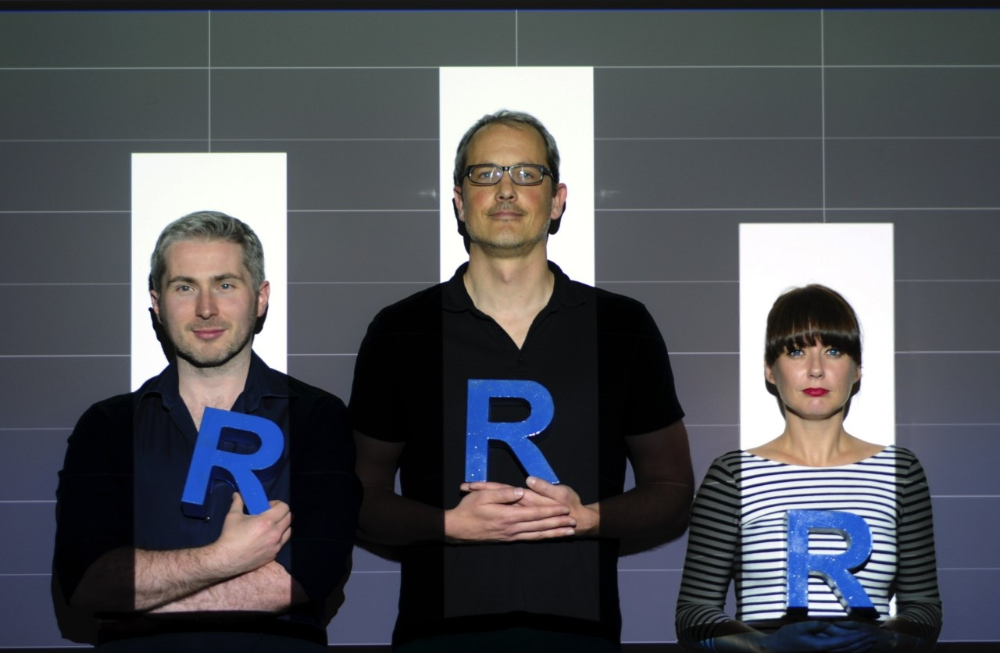

:::

::::

## fancy a writing retreat to a Scottish isle?

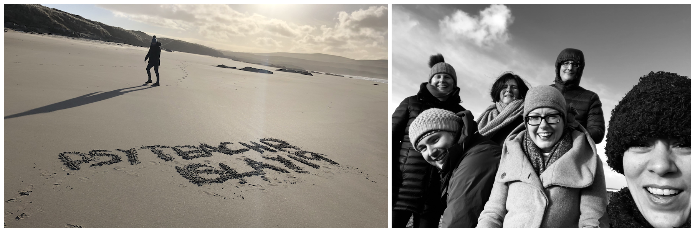

On a weekend trip to Islay (2019), Lisa DeBruine taught us to write books in `bookdown` (and to use Github) which made it possible for us to release our teaching materials online

<https://psyteachr.github.io>

<https://www.islayinfo.com>

# some final thoughts & tips...

- *"never accept the first no"* - Grace Hopper
- start small, move incrementally; this is a long-term project
- don't be the sole source of support: you will burn out
  - did I mention you need a team?
- remember: by ignoring these things you create massive invisible labor that **someone is currently doing** (usually supervisor or ECR)
- give students a taste of what they are missing; this will spark demand that you can then **leverage against timid administrators**
  - "if I were allowed, I would be teaching things in a different way [link to PsyTeachR.github.io]😉, please talk to your student rep and mention it in your course feedback"

# mission accomplished: empowerment achieved!

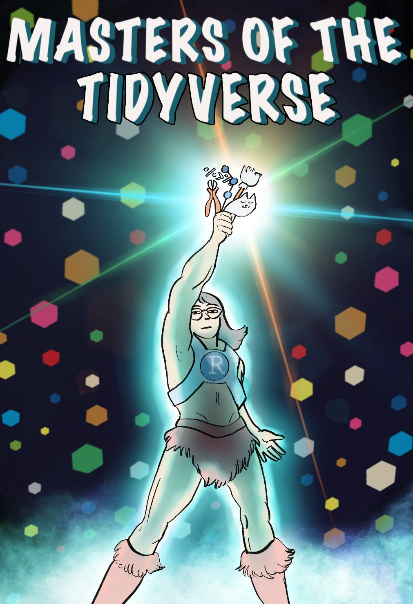


## References

::: {#refs}
:::
